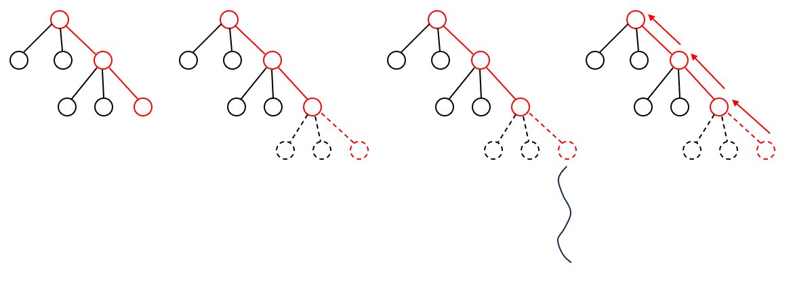
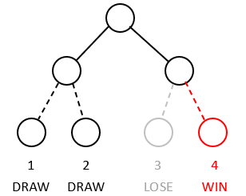

# ultimate-tictactoe
Various engines to tackle the game of ultimate tictactoe

## Algorithms

### Monte-Carlo Tree Search

Monte-Carlo Tree Search (MCTS) centres around the idea of maintain a "tree of knowledge". This tree of knowledge initially consists of only the root node. As the search progresses, this tree expands. Each node represents a state within the game.



Each iteration of MCTS involves 4 important steps:

1. Select
2. Expand
3. Simulate
4. Back propagate

The pseudo-code for MCTS is as follows:

```
root = current board
while (time remains) {
    leaf = root.select()
    child = leaf.expand()
    utility = child.simulate()
    child.backPropagates(utility)
}
return root.bestMove()
```

#### Select

In select stage, MCTS selects the "most promising" leaf. At each node, MCTS selects the most promising child to explore, and the selection continues until a leaf within the tree of knowledge is reached.

The most common policy for child selection is UCB.

$$
\begin{aligned}
& UCB(n) = \frac{U(n)}{N(n)} + C\sqrt{\frac{N(ln(n.parent))}{N(n)}}
\end{aligned}
$$

Where,
* $U(n)$: Total utility of node $n$ accumulated over the past simulations, initially $0$
* $N(n)$: Number of simulations that visit node $n$.
* $n.parent$: The parent node of node $n$.

The first term in UCB is the greedy term, while the second term is the exploration term. Constant $C$ is the balancing term between exploration and exploitation, and is usually $\sqrt{2}$. The child node select is then the child with the highest UCB value.

Ultimate tictactoe is a zero-sum game, which means that the same board has opposite utility value for the two sides. Hence, the utility value of the child is inverted when calculating the UCB value.

The pseudo-code for select is as follows:

```
class Node {
    function select() -> Node {
        if (node has no children) {
            return node;
        }
        bestChild = max(node.children, key=child -> UCB(child))
        return bestChild.select()
    }
}
```

#### Expand

Children nodes, which are the boards reachable through valid actions on the current board, are added to the tree. This is where the "tree of knowledge" is expanded. A random child of the current leaf node is then selected for evaluation in the next stage.

In the special case that the current leaf node is a terminal state of the game, we simply do not expand the tree, but evaluate the current node.

The pseudo-code for expand is as follows:

```
class Node {
    function expand() -> Node {
        if (node has no children) {
            return node;
        }
        actions = node.board.actions()
        nextNodes = []
        for (action: actions) {
            nextBoard = node.board.move(action)
            nextNodes.add(Node(parent=node, move=action, board=nextBoard))
        }
        return random(nextNodes)
    }
}
```

#### Simulate

This is the routine to evaluate a child node. From the child selected, random moves are selected until a terminal board is reached. The value of the child node is then the value of the terminal board.

This method is arguably not the optimal policy for board evaluation. However, it has the following advantages:

* Comparing to static evaluation of a board, this method does not require the knowledge of evaluation of a board.
* Comparing to selecting moves based on a heuristic, this method spends less time, and does not require the knowledge of what constitutes a good move.

Moreover, the board evaluation is more accurate as the tree of knowledge extends to greater depths.

#### Back propagate

This is where the knowledge tree updates. The agent assigns a positive score for the winning side at the respective boards (nodes), and a negative score for the losing side at the respective boards (nodes). The utility is then added to the total utility $U$ of a node.

```
class Node {
    function backProps(utility) {
        node.U += utility
        if (node has parent) {
            node.parent.backProps(-utility)
        }
    }
}
```

#### Move selection

Note that in the expansion of the knowledge of tree, the engine chooses the most promising moves based on the UCB value. When selecting a move for a real game, the engine then selects the move that has the highest playout count, $N(n)$.

### Q-learning

Q-learning keeps a hashmap $Q$ that stores the value of each board - action pair. During thinking, the engine constructs the $Q$ map, and returns the move that has the highest Q-value, or the action that maximises the value of $Q[board, action]$.

There are two important steps in a simulation iteration:

1. Simulate
2. Update

#### Simulate

The engine simulates a real game forward, starting from the current board, by selecting best moves for each side. At the end of simulation, a reward is determined based on who wins the game. The agent then updates the $Q$ table for each board - action pair in the simulation with the given reward.

There is a problem to this approach - the engine might not realise a better move. Consider the following game tree, where the root node is the current node.



There are two choices for the current board. The left child would definitely result in a draw, while for the right child, if the agent follows up with correct moves, will win.

The engine may have only reached nodes 1 and 3, and conclude that going to the left child is better. The engine therefore does not continue exploring the right child.

To combat this problem, we introduce a randomness - a probability that the engine may select a random move during training. The randomness ensures that at some point, the engine would consider the child on the right, and would then conclude that right child is better.

#### Update

The reward is updated at every board on the simulation. For the winning side, the reward is positive, while for the losing side, the reward is negative.

We do not simply replace the old Q-value with the new Q-value, the new Q-value might not be accurate. Instead, we use a learning coefficient $\alpha$, which represents how far the Q-value shifts towards the new value.

$$
\begin{aligned}
& Q[s, a] = Q[s, a] + \alpha (r - Q[s, a])
\end{aligned}
$$

In some variants of Q-learning, the agent also takes into account the future Q-values. However, in our game, the reward is given directly to the node, hence there is no need to consider the future values. On the other hand, if we take into account future values, the agent may choose the longest path towards winning, because each node on the way carries a positive Q-value. Remember that the utility of each node is dependent on whether the engine can win from there. Hence, the agent only needs to consider the Q-value of current node.

#### Implementation issues

**Insufficient number of games simulated**

The engine may not be able to explore all possible moves, hence the Q-value is not perfect. This is especially true for the initial boards. To mitigate this issue, we do not start from a new Q-table at every turn, but continue with the Q-table already constructed from the previous moves.

**Memory issue**

That leads us to this issue: the Q-table becomes very large. But one must notice: we do not have to keep every entry in the table! In fact, at the start of every turn, we only need to keep the entries with boards that are reachable from the current board.

Removing all irrelevant entries is not an easy task. With hashmap implementation of Q-table, we would have to enumerate all possible boards from the last board that does not go through the current board - a task that if accomplished, can resolve the above issue (of insufficient number of games simulated). There is no easy way to check if a board is reachable from the current board.

However, notice the order that we access values from this hashmap:

* In simulation, we access board entries from current board to an end board.
* In update, we access board entries from the end board back to the current board.

This gives us an idea: we can use tree implementation of Q-table! Each node therefore encapsulates the board and the children nodes that are the results of applying moves to the board. Each node also keeps track of the parent and the transitioning move.

Now we can effectively prune away irrelevant entries: at the start of our turn, we only continue with the subtree with the current board, and discard the rest of the parent tree from the previous search.

Each node also keeps track of a Q-value that represents how good the board is. Notice that this Q-value actually represents the Q-value of parent board - action pair.

* During simulation, when selecting the best move, we simply select the child that the lowest Q-value, minimising the opponent's value.
* During update, we update this Q-value for each node.

Hence the pseudo-code for move selection during simulation and update is as follow:

Move selection:

```
class Node {
    function selectMove() -> Move {
        with small prob: child = randomMove()
        otherwise: child = min(node.children, key=(child) -> child.qValue)
        return child.move
    }
}
```

Update:

```
class Node {
    function update(utility) {
        node.qValue += alpha * (utility - node.qValue)
        if (node has parent) {
            node.parent.update(-utility)
        }
    }
}
```

**Learning rate**

Tuning the learning rate is never an easy task. One thing we may notice: the learning rate for a starting board is the same as the learning rate for an ending board. This should not be the case! Similar to humans, when we loose a game, we conclude our mistakes nearer to the end of the games first. Only after a few iterations of playing the same opening moves, we can start to conclude whether our opening moves are good.

We therefore use variable learning rate. Learning rate is higher closer to the end, and lower closer to the start. Further tuning shows that an exponential function performs better.

$$
\begin{aligned}
& \alpha = Ae^{-kx}
\end{aligned}
$$

Where $x$ is the number of steps away from the end of the game.

#### Move selection

After having constructed the Q-table, our task of selecting the move for the real game play is simple: we look at the next boards, and select the action that results in the board with the lowest possible Q-value.

### Sarsa

Sarsa is very similar to Q-learning, that it keeps a "knowledge table". The difference is that, during update of Q-value, Q-learning assumes perfect moves afterwards, while Sarsa takes into account the game progression from the simulation.

Similar to Q-learning, we use tree implementation of the Q-table to save memory.

There are two important steps in Sarsa, similar to Q-learning:

1. Simulate
2. Update

#### Simulate

Simulation in Sarsa is similar to Q-learning, where there is a small probability of choosing a random move, otherwise the engine chooses the best move from the current Q-table.

Q-value of children are inverted in calculating the best move, as the engine should aim minimise the opponent's value.

#### Update

Q-update function is as follows:

$$
\begin{aligned}
& Q[s, a] = Q[s, a] + \alpha (r - Q[s, a] + \gamma Q[s', a'])
\end{aligned}
$$

Where $s'$ is the state obtained by applying action $a$ on state $s$, and $a'$ is the action taken at state $s'$ in the last simulation, and $\gamma$ is the discount factor, representing how much the engine should value future rewards.

In the update function, we only reward the terminal states with non-zero values. All intermediate states receive 0 reward. Meanwhile, $\gamma$ is set close to $1$, so that the engine solely focuses on the future rewards, which is to win the game. $\gamma$ is set to $0.99$, so that a shorter sequence of moves to winning is preferred over a longer sequence.

## User guide

1. Make sure that you have java version 11 on your computer. Key in the following command to check your version:

```
java --version
```

2. Download the latest binary from our [release tab](https://github.com/nknguyenhc/ultimate-tictactoe/releases).

3. Open the terminal at the folder that contains the downloaded jar file.

4. Run the jar file.

```
java -jar ultimate-tictactoe.jar
```

5. Follow the instructions in the programme to set up the game, including selecting the algorithm you would like to fight against, select time control, select the side you are playing.

6. At your turn, key in your move in the format `R, C`, where `R` is the row index and `C` is the column index. For example, if you want to go at row index 7 and column index 9, you should key in: `7, 9`. Note that the move you key in must be a valid move at the board.

7. Enjoy!

## Javascript release

Bytecoder is not a perfect libraries. There are still bugs within the library. For that, there are a few required edits on the javascript:

1. Some strings are segmented onto two different lines. Combine them into one line with delimiter `\n`.
2. Rewrite `Array::clone` method. The method `clone` is poorly transpiled for the `Array` class. Find `de$mirkosertic$bytecoder$classlib$Array::Ljava$lang$Object$$clone$$` method, and replace it with the following method body:

```js
  Ljava$lang$Object$$clone$$() {
    // source file is Array.java
    // line number 24
    const newArray = bytecoder.newarray(this.data.length, undefined);
    newArray.data = [...this.data];
    return newArray;
  }
```

3. Write `String::format` method. This method is not written in the exported javascript. The method looks something like this:

```js
function formatString(format, args) {
  let i = 0;
  return format.replace(/%(\w)/g, (match, type) => {
    const value = args[i];
    i++;
    switch (type) {
      case "s":
        return value;
      case "d":
        return parseInt(value);
      case "c":
        return String.fromCharCode(value);
      case "n":
        return "\n";
    }
    return match;
  });
}

function objectToReplaceableValue(object) {
  if (object.nativeObject) {
    return object.nativeObject;
  } else if (object.value) {
    return object.value;
  } else {
    return object.Ljava$lang$String$$toString$$().nativeObject;
  }
}

bytecoder.imports['java.lang.String'].Ljava$lang$String$$format$Ljava$lang$String$$$Ljava$lang$Object$ = (arg0, arg1) => {
  const objects = arg1.data.map(object => objectToReplaceableValue(object));
  const nativeString = formatString(arg0.nativeObject, objects);
  return bytecoder.toBytecoderString(nativeString);
};
```

The `formatString` does not account for all formats, but those formats are sufficient to format the string.
The method `objectToReplaceableValue` converts a bytecoder class to a native object/value that can be used in the `formatString` function.
Finally, we add the function `Ljava$lang$String$$format$Ljava$lang$String$$$Ljava$lang$Object$` to the imports on `'java.lang.String'`, which will be called whenever `String::format` is called in java.

4. Write `Math::pow` method. The method body looks something like this:

```js
bytecoder.imports['java.lang.Math'].D$pow$D$D = (a, b) => {
  return Math.pow(a, b);
};
```

On the user end, you need to take note of the following API. There is only one endpoint, `Web::getResponse(String)`. If in java, you would want to call the following:

```java
Web.getResponse("1");
```

Then in javascript, you would need to call the following:

```js
bytecoder.exports.getResponse(bytecoder.toBytecoderString("1"))
```
